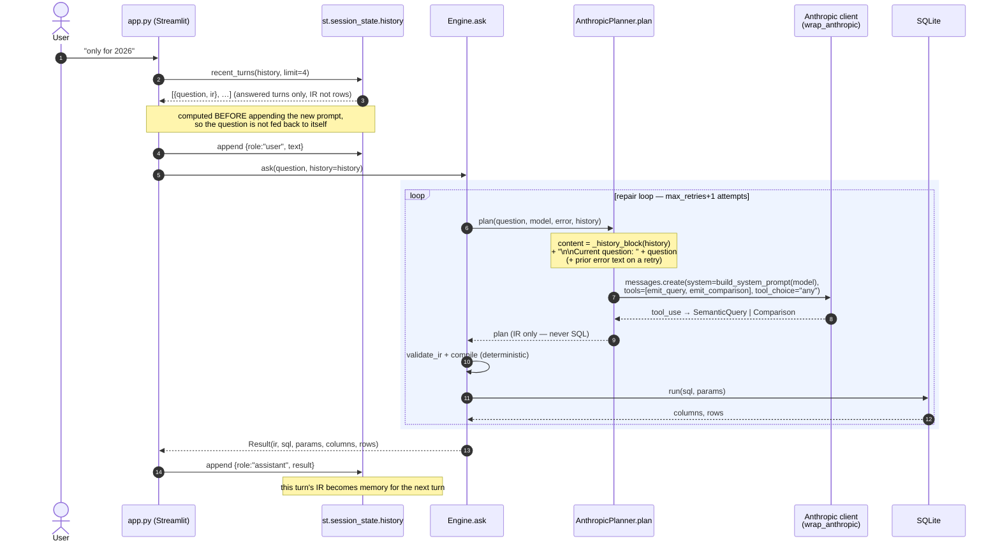
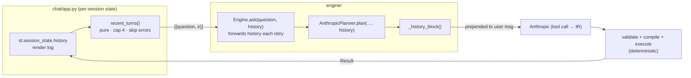

# Conversation memory

Short-term memory that lets the assistant resolve **follow-up** questions
("only for 2026", "break that down by class") by giving the planner the last few
turns. It is intentionally minimal: in-session only, no persistence, no
summarization.

The one invariant it must not break: **the LLM still only emits IR**
(`SemanticQuery` / `Comparison`), never SQL. Memory is extra *context* on the
prompt; everything from the IR onward stays deterministic.

## What is remembered

Two different representations of "history" coexist — don't confuse them:

| | `st.session_state.history` | `recent_turns(...)` output |
|---|---|---|
| Purpose | redraw the chat transcript | the planner's memory |
| Shape | `{role, text}` and `{role, result, summary}` / `{role, error}` | `[{"question": str, "ir": dict}]` |
| Contents | full `Result` objects (sql, rows, columns…) | just the question + the **IR** that turn produced |
| Size | whole session | capped at the **last 4 answered turns** |
| Error turns | kept (rendered as an error) | **excluded** (no IR to build on) |

We carry the **IR, not the result rows**: the IR is the compact record of *what
was computed* and is exactly what a refinement builds on; rows would be large and
irrelevant. `recent_turns` is a pure function (`text2sql/chat/app.py`) so it is
unit-tested without Streamlit.

## Round-trip (one follow-up turn)



## How history reaches the prompt

`_history_block(history)` (`text2sql/engine/planner.py`) renders the turns into a
compact block that is **prepended to the user message** — the static system
prompt is left untouched:

```text
CONVERSATION SO FAR (most recent last). Use it to resolve follow-up questions
like 'and for 2026' or 'break that down by class': carry over the previous
metrics/dimensions/filters unless the user changes them.
Q: show revenue by month
IR: {"metrics": ["total_amount"], "dimensions": ["txn_month"]}

Current question: only for 2026
```

The model then emits an IR that reuses the prior metric/dimensions and adds a
`txn_year = 2026` filter. Verified end to end against the live model:

```text
Q1 "show revenue by month" → dims [txn_year, txn_month], filter classification=Revenue   (24 rows)
Q2 "only for 2026"         → same dims + filter, PLUS txn_year = 2026                     (12 rows)
```

## Call path (who owns what)



## Key technical points

- **Threaded through the repair loop.** `Engine.ask(question, history=None)`
  passes `history` to `planner.plan(...)` on *every* attempt, so a re-plan after a
  recoverable error still has the conversation context.
- **Signature is uniform.** The `Planner` protocol and every stub take
  `history=None`; a planner that ignores it (e.g. the eval stubs) still works.
- **Bounded cost.** Cap of 4 turns × (question + one IR JSON) keeps added tokens
  small and predictable; there is no summarization step.
- **Observability.** With LangSmith on, the `CONVERSATION SO FAR` block appears in
  the nested Anthropic call's `messages` input, so you can watch follow-up
  resolution in the trace. (The parent `Engine.ask` span filters its own inputs to
  just `question` via `_trace_inputs`.)
- **Deliberately not done yet** (earned-abstraction): no cross-session
  persistence (session_state is wiped on restart and when switching datasets) and
  no history summarization. Both are clean follow-ups when needed.

## Tests

`tests/test_memory.py` covers all three layers: `recent_turns` extraction /
error-skipping / cap, `_history_block` rendering, the planner prompt carrying the
block (fake Anthropic client), and `Engine.ask` forwarding history verbatim while
still executing.
